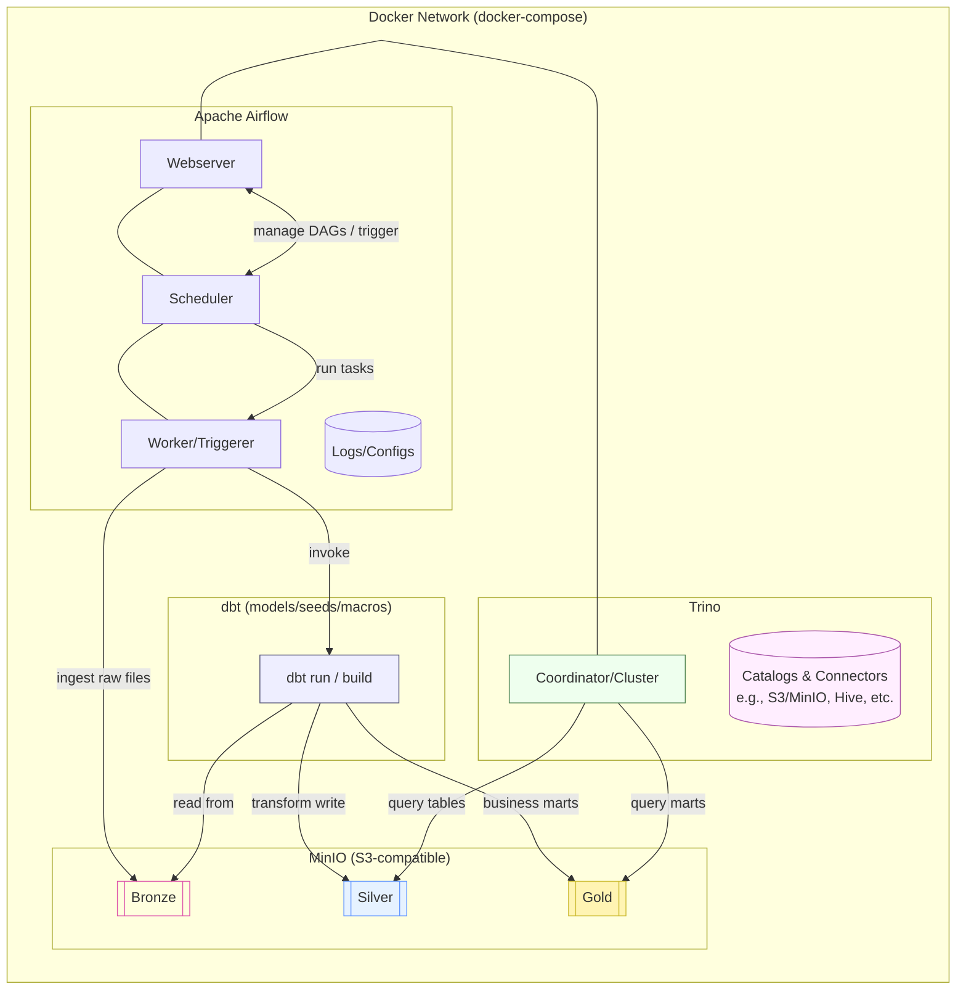

# DE-assignment

Data Engineering assignment stack for practicing **Airflow orchestration**, **dbt transformation**, **MinIO storage**, and **Trino SQL query engine**.  
(โปรเจกต์นี้ใช้สำหรับฝึก Data Engineering: Orchestration, Transformation, Storage, Query)

---

## 🏗 Stack Overview
- **Apache Airflow** → orchestrator (schedule & run DAGs)  
- **dbt** → transformation (bronze → silver → gold)  
- **MinIO** → S3-compatible object storage (data lake)  
- **Trino** → SQL query engine (query data in MinIO)  
- **Docker Compose** → run all services in containers  

---

## ✅ Prerequisites
- Git  
- Docker ≥ 20.x  
- Docker Compose ≥ v2.x  
- Bash/Shell  
- RAM ≥ 8 GB, CPU ≥ 2–4 cores  
- Open ports:  
  - `8080` (Airflow)  
  - `8081/8082` (Trino)  
  - `9000/9001` (MinIO)  
- `.env` file with:
  - `AIRFLOW_UID`, `AIRFLOW_GID` (default: 50000)  
  - `MINIO_ROOT_USER`, `MINIO_ROOT_PASSWORD`  

> ⚠️ No Python needed on host — everything runs inside containers.  

---

## ⚡ Quick Start
1. Clone the repo  
   ```
   git clone https://github.com/lu69x/de-assignment.git
   cd de-assignment
   ```

2. Create .env file (if missing) and set required variables

3. Run initial setup
    ```
    sudo chmod 755 setup.sh
    ./setup.sh
    ```
    or
    ```
    bash setup.sh
    ```

4. Start all services
    ```
    docker compose -f full-build-docker-compose.yaml up -d
    ```
5. Access services:
  - Airflow UI → http://localhost:8080
  - MinIO Console → http://localhost:9001
  - Trino Coordinator → http://localhost:8081


## System Diagram
