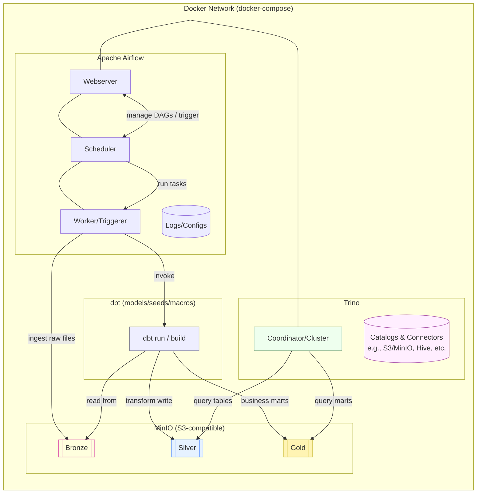

```mermaid
flowchart LR
  subgraph Docker_Network["Docker Network (docker-compose)"]
    A[Client / Analyst<br/>• Airflow UI<br/>• Trino SQL Client]:::ext

    subgraph Airflow_Stack["Apache Airflow"]
      A1[Webserver] --- A2[Scheduler] --- A3[Worker/Triggerer]
      A4[(Logs/Configs)]
    end

    subgraph Transform["dbt (models/seeds/macros)"]
      D1[dbt run / build]:::job
    end

    subgraph Storage["MinIO (S3-compatible)"]
      M1[[Bronze]]:::bronze
      M2[[Silver]]:::silver
      M3[[Gold]]:::gold
    end

    subgraph Query["Trino"]
      T1[Coordinator/Cluster]:::svc
      T2[(Catalogs & Connectors<br/>e.g., S3/MinIO, Hive, etc.)]:::meta
    end
  end

  %% Data flow
  A1 <-- manage DAGs / trigger --> A2
  A2 -->|run tasks| A3
  A3 -->|ingest raw files| M1
  A3 -->|invoke| D1
  D1 -->|read from| M1
  D1 -->|transform write| M2
  D1 -->|business marts| M3
  T1 -->|query tables| M2
  T1 -->|query marts| M3
  A:::hidden

  %% External access
  A --- A1
  A --- T1

classDef ext fill:#fff,stroke:#888,stroke-width:1px
classDef job fill:#eef,stroke:#557
classDef svc fill:#efe,stroke:#585
classDef meta fill:#fef,stroke:#a5a
classDef bronze fill:#f9e0,stroke:#d5a
classDef silver fill:#e6f2ff,stroke:#69f
classDef gold fill:#fff4b3,stroke:#cb3
classDef hidden display:none
```