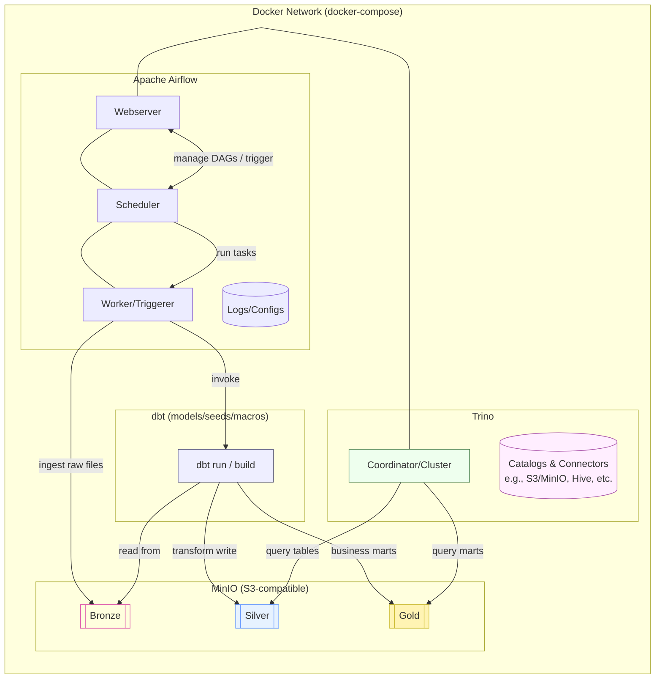

# DE-assignment

Data Engineering assignment stack for practicing **Airflow orchestration**, **dbt transformation**, **MinIO storage**, and **Trino SQL query engine**.  
(โปรเจกต์นี้ใช้สำหรับฝึก Data Engineering: Orchestration, Transformation, Storage, Query)

---

## 🏗 Stack Overview
- **Apache Airflow** → orchestrator (schedule & run DAGs)  
- **dbt** → transformation (bronze → silver → gold)  
- **MinIO** → S3-compatible object storage (data lake)  
- **Trino** → SQL query engine (query data in MinIO)  
- **Docker Compose** → run all services in containers  

---

## ✅ Prerequisites
- Git  
- Docker ≥ 20.x  
- Docker Compose ≥ v2.x  
- Bash/Shell  
- RAM ≥ 8 GB, CPU ≥ 2–4 cores  
- Open ports:  
  - `8080` (Airflow)  
  - `8081/8082` (Trino)  
  - `9000/9001` (MinIO)  
- `.env` file with:
  - `AIRFLOW_UID`, `AIRFLOW_GID` (default: 50000)  
  - `MINIO_ROOT_USER`, `MINIO_ROOT_PASSWORD`  

> ⚠️ No Python needed on host — everything runs inside containers.  

---

## ⚡ Quick Start
1. Clone the repo  
   ```
   git clone https://github.com/lu69x/de-assignment.git
   cd de-assignment
   ```

2. Create .env file (if missing) and set required variables

3. Run initial setup
    ```
    sudo chmod 755 setup.sh
    ./setup.sh
    ```
    or
    ```
    bash setup.sh
    ```

4. Start all services
    ```
    docker compose -f full-build-docker-compose.yaml up -d
    ```
    To expose the interactive dbt docs console run the docs service as well:
    ```
    docker compose -f full-build-docker-compose.yaml up -d dbt-docs
    ```
5. Access services:
  - Airflow UI → http://localhost:8080
  - MinIO Console → http://localhost:9001
  - Trino Coordinator → http://localhost:8081
  - dbt Docs Console → http://localhost:8082 (or `http://localhost:${DBT_DOCS_PORT}` if customized)


## System Diagram


## 📊 Data Lineage (dbt Docs)
The `data_engineer_assignment` DAG now generates dbt documentation after every run. This produces the manifest, catalog, and the interactive lineage graph so you can trace every mart back to its staging sources.

1. When the DAG finishes the `publish_lineage_docs` task uploads the docs bundle to MinIO using the bucket/prefix configured by `S3_BUCKET` and `S3_DOCS_PREFIX` (default: `warehouse/assignment/docs`).
2. Each run is versioned by timestamp (e.g. `s3://warehouse/assignment/docs/20250101120000/index.html`) and a `latest/` alias is refreshed for convenience.
3. Open the MinIO Console → bucket `warehouse` → folder `assignment/docs/latest/` and download `index.html` (and the accompanying assets) or click the object preview to render the lineage graph directly in the browser.
4. You can also sync the folder locally with the MinIO CLI / AWS CLI: `aws --endpoint-url http://localhost:9000 s3 sync s3://warehouse/assignment/docs/latest ./docs` then open `./docs/index.html`.
5. ต้องการแชร์ต่อให้ทีม? คุณสามารถรันเว็บเซิร์ฟเวอร์แบบง่าย ๆ เพื่อเสิร์ฟไฟล์เอกสารได้ เช่น `python -m http.server --directory ./docs 8000` แล้วให้เพื่อนร่วมทีมเปิด `http://<เครื่องคุณ>:8000/index.html` หรืออัปโหลดโฟลเดอร์นี้ไปยัง static hosting ใด ๆ (S3, GitHub Pages, ฯลฯ) ได้ทันที

### Live dbt docs console
- Start the containerized console with `docker compose up -d dbt-docs`. The service automatically runs `dbt deps`, regenerates docs, and launches `dbt docs serve` on port `8082` (override via `DBT_DOCS_PORT`).
- After the DAG publishes a fresh bundle, refresh the browser at `http://localhost:8082` to explore the interactive lineage graph without downloading files manually.
- The console mounts your local `dbt/` folder, so edits to models/macros can be reloaded by restarting the service.

### ขั้นตอนต่อยอดหลังได้ docs
- **วิเคราะห์ lineage**: เปิด `index.html` แล้วสำรวจ lineage graph เพื่อดูว่าตาราง downstream พึ่งพา source ใดบ้าง ช่วยตรวจสอบผลกระทบก่อนแก้ไขโมเดล
- **แนบใน PR / RFC**: ถ่าย screenshot หรือ export diagram จาก dbt docs เพื่อแปะในเอกสารออกแบบ ทำให้ทีมเห็นภาพรวมของ pipeline
- **ใช้เป็น living documentation**: ตั้ง automation เพิ่มเติม (เช่น Airflow sensor หรือ GitHub Action) ให้ sync `assignment/docs/latest/` ไปยังพื้นที่แชร์ของทีมทุกครั้งที่ DAG รันสำเร็จ เพื่อให้ทุกคนเข้าถึง lineage ล่าสุดได้เสมอ
- **ตรวจสอบคุณภาพข้อมูล**: ส่วน `Tests` ใน dbt docs แสดงผลการรัน test ล่าสุด ช่วยให้ทีม Data/Analytics ตรวจสอบคุณภาพข้อมูลก่อนใช้งานจริง

> Tip: dbt exposures defined under `dbt/models/schema.yml` describe downstream dashboards so the lineage view highlights how marts power each consumer.
